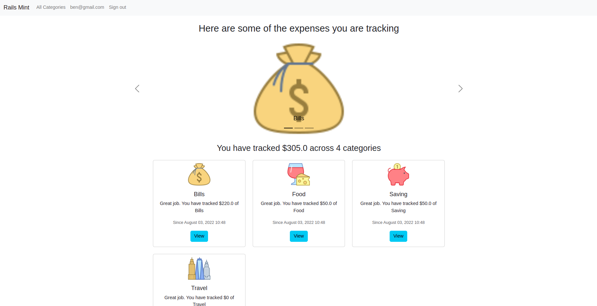
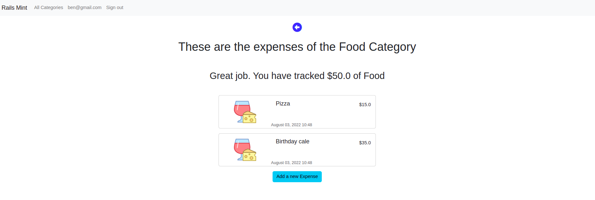

# Ruby on Rails - Rails Mint

> This repo hosts the Rails Mint web-app that allows tracking spending. The app allows you to monitor your expenses per category and your total expenses.Once logged in you can add the list of Categories you wish to track and from there you can add expenses under your respectrive categories. Each category has a unique icon that allows you to visualize your expenses

## Preview

## Video Presentation 

- Watch this video Presentation to get up to speed with how the app works. 

## Live Link

- Visit this [live link](https://rails-mint.herokuapp.com/) to interact with the web app before cloning it.

## Built With

- **Ruby**
- **Rails**
- **Postgresql**
- **CSS**

## Methodology used 
- TDD via RSPEC
  
## Getting Started
To get a local copy up and running follow these simple example steps.

## Prerequisites

- You need Ruby v3+, Rails v7+ and Postgresql installed on your machine.

## Setup
- Clone the project `git clone git@github.com:Benmuiruri/rails-mint.git`
- navigate to the folder `cd rails-mint`
- Install required gems `bundle install`
- Load the database `rails db:reset`

## Usage
- start the server `rails server`

- Enjoy interacting with the app.

## Author

👤 **Ben Kiarie**

- GitHub: [Ben Kiarie](https://github.com/Benmuiruri) - Follow me on Github, browse my projects, and leave a star for any project you like.
- Twitter: [Optimize](https://twitter.com/_optimize) - Follow me on Twitter I will make your Timeline a bit more interesting
- LinkedIn: [Ben Kiarie](https://www.linkedin.com/in/benjamin-kiarie-180b66149/) - Connect with me on LinkedIn and help each other grow professionally

## 🤝 Contributing

Contributions, issues, and feature requests are welcome!

Feel free to check the [issues page](https://github.com/Benmuiruri/rails-mint/issues).

## Show your support

Give a ⭐️ if you like this project!

## Acknowledgments
Hat tip to anyone whose code inspired our project
  
